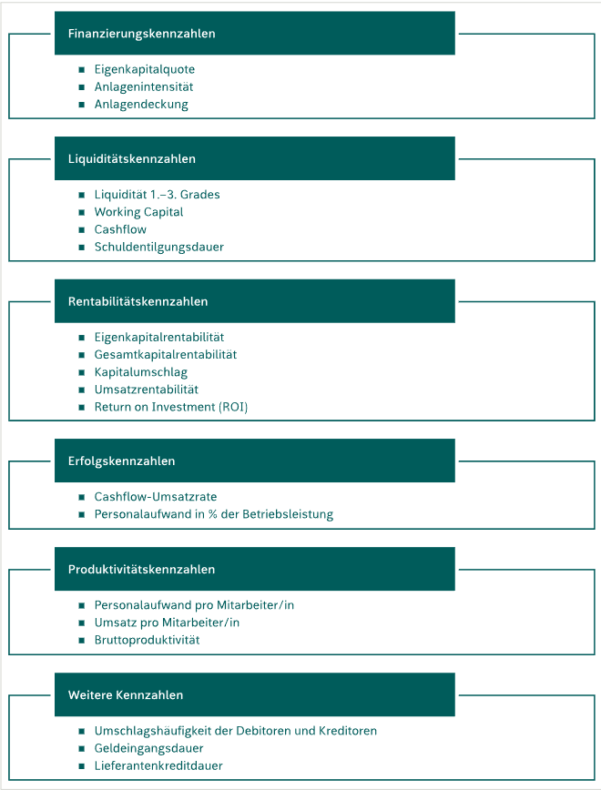
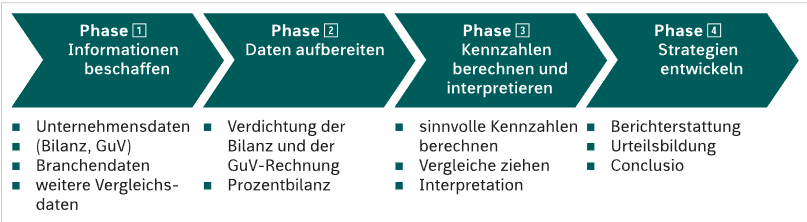
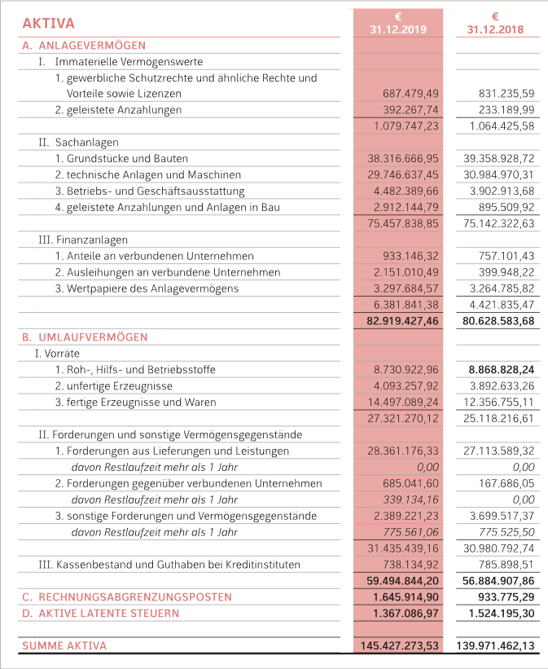
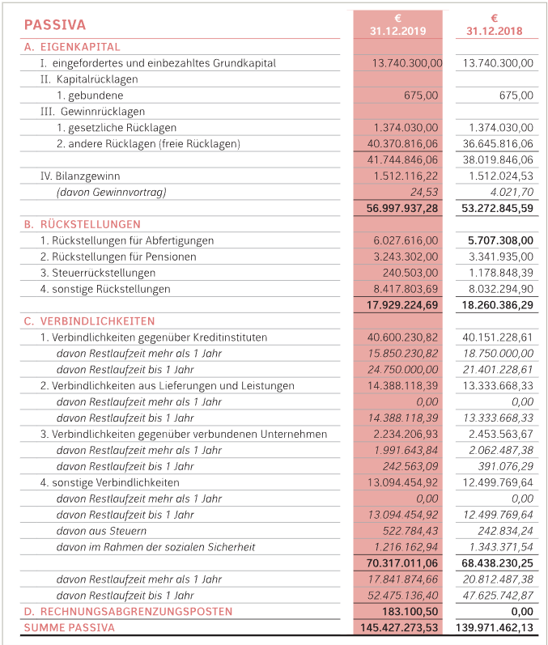
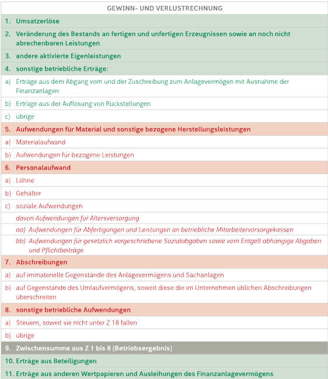
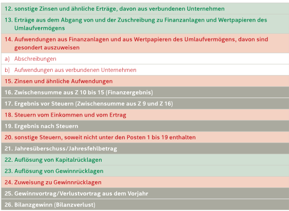
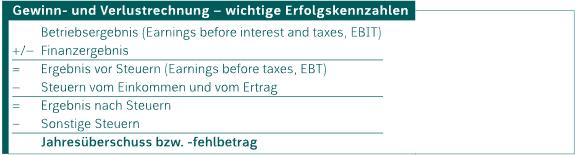

# Kennzahlen
---
Kennzahlen sind Zahlen, wo durch man erkennen kann ob es einem Unternehmen gut oder schlecht geht. Zur Analyse verwendet man wichtige Daten aus dem  GuV - Rechnungen und der Bilanz.

Cashflow = Geld, das übrigbleibt
EBIT = beschreibt den operativen Gewinn aus dem Leistungsbereich eines Unternehmens in einem bestimmten Zeitraum
Ergebnis vor Steuern = erwirtschafteter Gewinn vor Abzug des gesamten Steueraufwand
Return on Investment = Messung der Rendite einer unternehmerischen Tätigkeit
Eigenkapitalquote = Verhältnis von Eigenkapital zum Gesamtkapital eines Unternehmens
Rentabilität = Beurteilung des wirtschaftlichen Erfolgs eines Unternehmens
Gewinnwarnung = Wertpapierrecht -> die Warnung eines börsennotierten Unternehmens gegenüber der Öffentlichkeit
operatives Betriebsergebnis = EBIT
Liquidität = Zahlungsfähigkeit

## Arten von Kennzahlen

### Welche Phasen können in der Jahresabschlussanalyse unterschieden werden?
Die Analyse wird in vier Phasen unterteilt:

1. **Phase: Informationen beschaffen**
   Wichtige Unternehmensdaten(Kennzahlen), wie GuV, Bilanz, Mitarbeiterzahl, etc. werden gesammelt. Da diese Daten ohne Vergleich kaum Aussagekraft haben muss man auch die Vergleichsdaten einbeziehen.
   Nachdem man die nötigen Kennzahlen hat, kann man sich eine Vergleichsmethode aussuchen.
   - **Zeitvergleich:** Kennzahlen aus dem Vorjahr mit der aktuellen Kennzahl vergleichen
   - **Branchenvergleich:** Strukturdaten aus der gleichen oder ähnlichen Branche vergleichen
   - **Soll-Ist-Vergleich:** Plandaten vergleichen
2. **Phase: Daten aufbereiten**
    Die gesammelten Daten werden nun analysiert. Ob es eine interne oder externe Analyse ist, hängt von der Notwendigkeit ab.
    - interne Jahresabschlussanalyse ("Betriebsanalyse"): 
     Den Analystinnen/ Analysten stehen detaillierte Informationen zur Verfügung(z.B. Verkaufsstatistik, kostenrechnerische Werte), welche geheim gehaltet werden.
    - externe Jahresabschlussanalyse: 
      In dieser Analyse werden bereits veröffentlichte Daten, ungenauerer Jahresabschlüsse, wenn vorhanden Anhang und Lagebericht.
3.  **Phase: Kennzahlen berechnen und interpretieren**
    Nachdem die Kennzahle analysiert wurden, müssen sie nur noch berechnet und interpretiert werden.
    Folgende Tipps können Ihnen dabei helfen:
    - Aussagekräftigste Vergleichsdaten verwenden: 
      Negatives Beispiel -> Umsatz der Personalkosten eines österreichische Unternehmens mit einer chinesischen zu vergleichen
    - Kennzahlen nie isoliert betrachten, andere Kennzahlbereiche auch einbeziehen
    Negatives Beispiel-> nur weil ein Unternehmen nicht liquide ist bedeutet es nicht, dass sie kein Umsatz machen.
    - der wichtigste Teil ist die **Interpretation** der Kennzahlen
4. **Phase: Strategien entwickeln**
     Nun wird alles in einem Bericht zusammengefasst-> **Reporting**       
## Vorbereitung des Jahresabschlusses
 - **Die Bilanz: erste Vorbereitung für die Jahresabschlussanalyse**
 Strukturbilanz ist eine Bilanz in der einige Bilanzpositione zusammengefasst werden, um einen besser Überblick über den Umsatz und unterschiedlichen Jahresabschlüssen hat. Diese vereinfacht uns die Arbeit beim vergleichen. Die Strukturbilanz kann auch in Prozenten angegeben werden -> **Prozentbilanz**.

 Ein Blick in die Praxis:

 
  
  **latente Steuern** = ergibt sich aus dem Unterschied zwischen unternehmensrechtlichen und steuerrechtlichen Wertansätzen.
  Aktive latente Steuern = zukünftige Steuervorteile
  Passive latente Steuern = hingegen zukünftige Steuerlast.
   - Aktiva der Bilanz: Erstellen der Struktur- und Prozentbilanz, Recherche kennzahlenrelevanter Daten
   Jede einzelen Bilanzposition wird in Prozent des Gesamtvermögens berechnet : $\frac{Bilanzposition}{Gesamtvermögen}$ x 100
   Prozentbilanz = Bewegungsbilanz
   
   
   kurzfristige Forderungen:
     - Forderungenaus Lieferung und Leistungen
     - sonstige Forderungen(zB. Kreditinstitut)
    - aktive Rechnungsabgrenzungsposten
   **Wie kann man unterscheiden ob eine Forderung kurzfristig oder langfristig ist?**
    - externe Analyse: Restlaufzeit < als ein Jahr -> direkt in die Bilanz
   ältere werden im Forderungsspiegel in einer Tabelle aufgelistet.
    - interne Analyse: genaue Werte aus dem Buchhaltungskonten bzw. Kostenrechnung
- Passiva der Bilanz: Erstellen der Struktur- und Prozentbilanz, Recherche kennzahlenrelevanter Daten
 In der Strukturbilanz der Passivseite wird zwischen kurz- und langfristigen Verbindlichkeiten bzw. Fremdkapital differenziert.
     - **kurzfristige Verbindlichkeiten:**
       - Verbindlichkeiten aus Lieferungen und Leistungen
       - sonstige Verbindlichkeiten
     - **kurzfrisitige Rückstellungen:**
       - Steuerrückstellungen
       - sonstige Rückstellungen
     - **Passive Rechnungsabgrenzungen:**
          - externe Analyse: Restlaufzeit < als ein Jahr -> direkt in die Bilanz
   ältere werden in einer Tabelle aufgelistet. Rückstellungen sind im Geschäftsbericht enthalten.
         - interne Analyse: Bei Betriebsanalysen sind die kurz- und langfristigen Fremdkapitale  bekannt.
       
- Die GuV-Rechnung: auf der Suche nach dem wahren Gewinn

Die GuV-Rechnung kann in **Gesamkostenverfahren**, Erlöse - Aufwand(in derselben Periode) oder **Umsatzkostenverfahren** dargestellt werden.
Gesamtkostenverfahren:
   
   

Die GuV-Rechnung weist mehrere Zwischenergebnisse-> unterschiedlichen "Gewinnen"
Punkt 9. zeigt Betriebsergebnis
Punkt 16. zeigt das Finanzergebnis
Betriebsergebnis + Finanzergebnis = Ergebnis vor Steuer
 