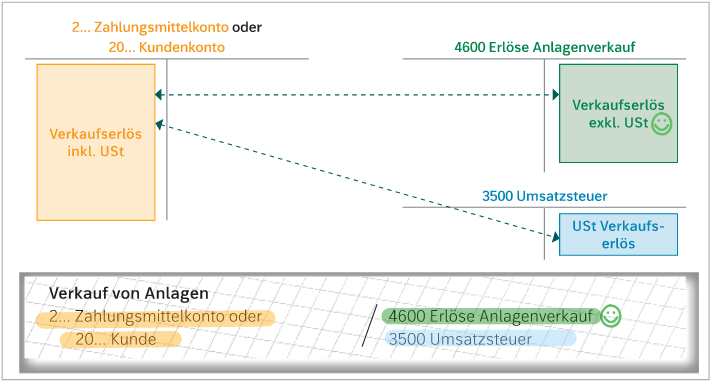
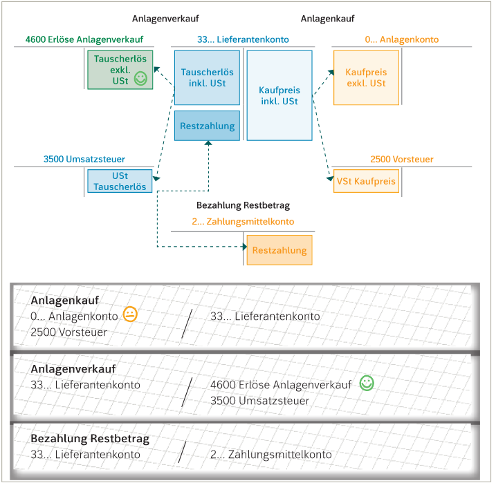
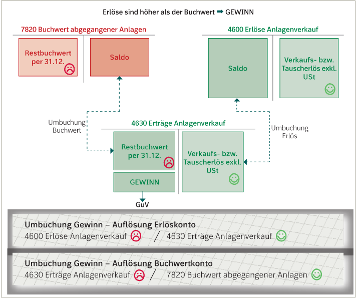
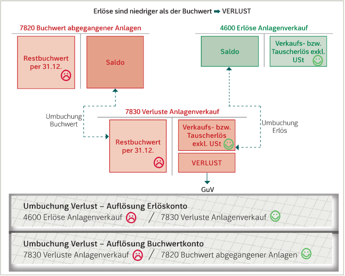

# Abgang von Sachanlagen
---
Ein Anlage kann **verkauft** oder **getauscht** werden. In beiden Fällen wird während des Jahres der Verkauf bzw. Eintausch verbucht.

Die Punkte müssen am Bilanzstichtag nach einem Verkauf oder Eintauch beachtet werde:
- die Anlage muss noch für dieses Jahr **abgeschrieben** werden
- bleibt noch ein **Restwert** von der Anlage übrig, muss dieses **ausgebucht** werden.
---> Anlage scheidet aus der Buchhaltung aus

Es gibt auch Fälle, wo die Anlage aufgrund eines Schadens ausfällt ---> **Schadensfall**. In diesem Fall kann man von der Versicherung Geld bekommen, jedoch muss die Anlage dafür versichert gewesen sein.

#### Buchung
- **Verkauf**
   Beim Verkauf macht das Unternehmen **Plus** ---> Erlös
   
   
- **Eintausch**
    Der Eintausch beinhaltet zwei Geschäftsfälle.
	- Anlage wird gekauft--> neue Anlage wird aktiviert.
	- eine andere Anlage wird an den Lieferanten verkauft--> Verbindlichkeit gegenüber dem Lieferanten erniedrigt sich.
   
- **Schadensfälle**
![[Schadensfallbuchung.png]]   

#### Abschlussbuchung
Wenn eine Anlage vor ihrer Nutzungsdauer aus dem Betrieb ausscheidet, muss sie im letzten Jahr noch **abgeschrieben** und **ausgebucht** werden.
   
 - **Abschreibung**
  **Hier muss die Halbjahresregelung beachtet werden!!**
  In der ersten Jahreshäfte (inkl 30.06) -> Halbabschreibung
  In der zweiten Jahreshälfte (ab 01.07) -> Vollabschreibung
  
 - **Ausbuchung der Anlage -> Ausbuchen des Restbuchwerts**
  
   
  
  
  #### Saldierungsbuchungen: Verbuchung des beim Verkauf/ Tausch erzielten Erfolges
  
  Um den erzielten Erfolg bei einem Verkauf oder Tausch auszurechnen:
  
  Verkaufs- bzw Tauscherlös exkl. Ust - Buchwert(Aufwand) = Erfolg
  
  - **Verbuchung**
     1. Saldierungsbuchung bei einem Gewinn 
       
	 2. Saldierungsbuchung bei einem Verlust 
       
  