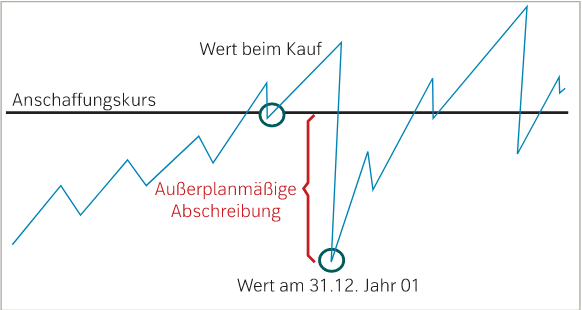
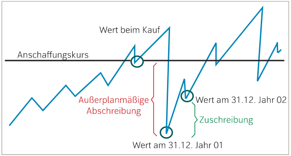
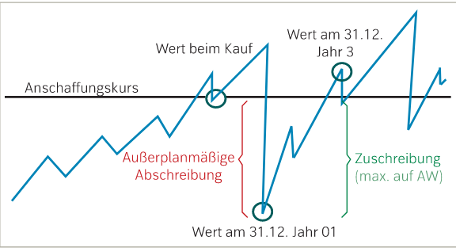

# Bewertung von nicht abnutzbarem Anlagevermögen
---
Anlagen, welche nicht generell oder regelmäßig an Wert verlieren, nennt man nicht abnutzbare Anlagevermögen.

Der unterschied zwischen den abnutzbaren und nicht abnutzbaren Anlagen ist, dass abnutzbare Anlagen jährlich an Wert verlieren und eine Nutzungsdauer haben. Nicht abnutzbare Anlagen können an Wert verlieren und gewinnen.

**Außerplanmäßige Abschreibung**
Wenn eine nicht abnutzbare Anlage an Wert verliert, dann musst dieser in der Buchhaltung durch die **außerplanmäßige Abschreibung** gezeigt werden. 

**Zuschreibung**
Wie schon vorhin erwähnt, kann der Wert diese Art von Anlage steigenm, welches in der Bilanz, durch die **Zuschreibung** dargestellt wird. Die Zuschreibung ist das Gegenteil der Abschreibung.  

**Anschaffungswertprinzip**
Wenn man eine Zuschreibung durchführt, darf diese den **Anschaffungswert**A nicht überschreiten. 

**Stille Reserve**
Stille Reserven sind Vermögen eines Unternehmens, die in der Bilanz, aufgrund des Niederwertsprinzips, nicht ersichtlich sind. Sie entstehen durch die Unterbewertung von Vermögen sowie die Überbewertung von Schulden.

**Bewertungsregeln im Detail**
Folgende Details gelten als Regel für die Zu- und Abschreibung:

Wann soll man eine planmäßige Abschreibung durchführen?
- Wertminderung ist voraussichtlich von Dauer: Abschreibung muss durchgeführt werden
- Wertminderung ist voraussichtlich nur kurzfristig: 
             - Finanzanlagevermögen: kann durchgeführt werden
             - überiges Anlagevermögen: darf nicht durchgeführt werden

Wann soll eine Zuschreibung durchgeführt werden?
- nicht abnutzbares Vermögen: Obergrenze Anschaffungswert
- abnutzbares Vermögen: Obergrenze aktuelle Buchwert

# Grundzüge der Bewertung
**Grundsätze ordnungsgemäßer Bilanzierung(GoBil)** sind die Regeln für die Aufstellung eines Jahresabschlusses:

- **Grundsatz der Bilanzwahrheit:** bei der Aufstellung der Bilanz an sämtliche Grundsätze halten
- **Grundsatz der Bilanzvollständigkeit:** Vollständigkeit der Bilanz und der GuV
- **Grundsatz der Einzelbewertung:** Vermögensgegenstände und Schulen einzeln bewerten
- **Grundsatz der kaufmännischen Vorsicht:** Unternehmen muss arm aussehen -> imparitätisches Realisationsprinzip
            - **Niederwertsprinzip:** ist Anlage am Bilanzstichtag geringer, als bei der laufenden Buchung -> abwerten
            - **Höchstwertsprinzip:** sind Schulden am Bilanzstichtag höher, als bei der laufenden Buchhaltung -> aufwerten 
- **Grundsatz der Bewertungsstetigkeit:**  einmal angewandte Bewertungsmethode ist beizubehalten
- **Grundsatz der Bilanzklarheit:** Bilanz und GuV klar und übersichtlich
- **Grundsatz des Stichtagsprinzip:** Werterhellende Umstände müssen vor Bilanzstichtag eingetragen werde, jedoch werden sie erst nachdem Bilanzstichtag bekannt. Diese müssen berücksichtigt werden.
- **Grundsatz der Periodenabgrenzung:** Aufwendungen und Erträge sin im selben Geschäftsjahr zu erfassen
- **Grundsatz der Wesentlichkeit:** wenn die Einhaltungen unwesentlich ist, müssen die vom Gesetz gestellten Anforderungen nicht berücksichtigt werden.