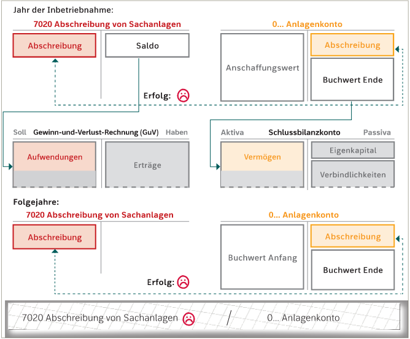
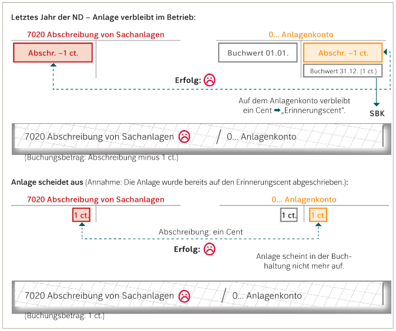

# Direkte Abschreibung
----
Eine Anlage verliert jährlich an Wert, welche mit der Abschreibung verbucht wird.
Bei der direkten Abschreibung werden die Konten 7020 Planmäßige Abschreibung von der Sachanlage und das Anlagenkonto verwendet.
Die Buchung findet bei 7020 Planmäßige Abschreibung von der Sachanlage  im Soll und im Anlagenkonto im Haben, welche den Wert der Anlage vermindert---> Verminderung des Erfolgs :(

Bei der Abschreibung muss man auf das Datum der Inbetriebnahme achten. Wenn die Inbetriebnahme der Anlage in der zweiten Jahreshälfte (01.07) stattgefunden hat, ist in diesem Jahr eine **Halbjahresabschreibung** durchzuführen.

**Ende der Nutzungsdauer**
Eine Anlage kann nur so lange abgeschrieben werden, solange sie eine Buchwert hat. Nach der Nutzungsdauer kann eine Anlage entweder aus dem Betriebsvermögen ausgeschieden werden( Anlagenkonto wird vollständig aufgelöst), oder weiterhin verwendet werden.

Falls die Anlage nach ihrer Nutzungsdauer noch im Betrieb verwendet wird, ist das **Erinnerungscentsprinzip** anzuwenden. Dieses Prinzip wird verwendet damit die Anlage noch im Betrieb noch zu sehen ist.

**Prinzip des Erinnerungscent:**
Im letzten Abschreibungsjahr werden so viel abgebucht, dass im Konto noch **1 Cent** übrigbleibt. Dieser Cent bleibt im Konto bis die Anlage aus dem Betrieb ausscheidet.

