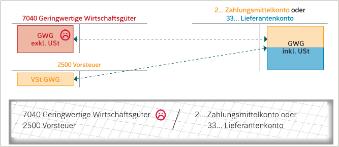
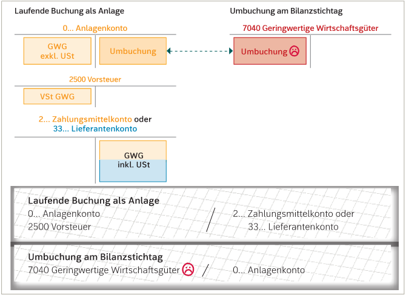

# Geringwertige Wirtschaftsgüter
---
Anlagen mit Anschaffungswert bis 800€ exkl.Ust, werden als **geringwertige Wirtschaftsgüter** (GWG) bezeichnet. GWG dürfen im Jahr der Anschaffung ganz als Betriebsaufwand verbucht werden.
7040 Geringwertige Wirtschaftsgüter

### Verbuchung

 1. Sofortige Verbuchung
 Beim Kauf wird das GWG direkt in den Aufwandskonto gebucht.
  
  
 2. 
     Beim Kauf wird das GWG in ein Anlagenkonto gebucht und am Bilanzstichtag in ein Aufwandskonto. 
     Grund????? 

