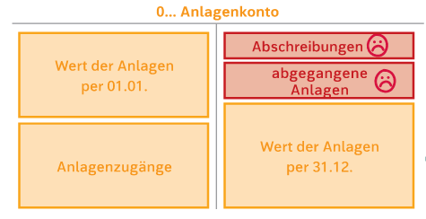

# Zugang zum Anlagevermögen
---
Es gibt drei Arten von Anlagevermögen:
- Immaterielle Vermögensgegenstände: nicht physische Anlagen(Software,Schutzrechte usw.)
- Sachanlagen: physische Anlagen(Fahrzeuge,Geschäftseinrichtungen, Maschinen, usw.)
- Finanzanlagen: Investitione in fremde Unternehmen(Aktien,Anliehen)

Anlagen die einen Anschaffungswert bis 800,00€ haben, zählen als **GWG(geringwertige Wirtschaftsgüter)**, welche im Jahr des Kaufes vollabgeschrieben werden können.

Die Buchung der Anlagen geschehen im **0.. Konto**.

### Zukauf, Selbsterstellung, Miete/Leasing
Arten Anlagen zu erwerben:
- Der Kauf: Eigentümer der Anlage werden -> Anlagenkonto wird eröffnet
- Das Vermieten von Anlagen: ist Aufwand, weil man kein Eigentümer ist, taucht es auch nicht in der Anlage auf.  -> kommen in die GuV
- Leasing von Anlagen: ist Aufwand, weil man kein Eigentümer ist, taucht es auch nicht in der Anlage auf. -> kommen in die GuV
- Selbsterstellung: Als ein bestimmes Unternehmen kann ich meine eigen Anlage erstellen. Beispiel Druckerproduzent-> Drucker. Für diese Anlage wird ein Anlagenkonto eröffnet. Kosten der Anlage sind Material- , Personalkosten, usw.

Anlage verliert jährlich an Wert --> Abschreibung.

   - Anschaffungswert
      Anschaffungswert sind alle Kosten ohne Ust. Besagt, ob es GWG oder Anlage ist.
	  **Anschaffungwert= Anlagenpreis + Nebenkosten - Preisminderung**
	  - **Nebenkosten**: Transport-, Installation usw.
	  -  **Preisminderung**: Rabatte, Skonto, usw.
## Buchung
- Kauf:
          ![[KaufBuchung.png]]
- Nebenkosten	
![[Nebenkostenbuchung.png]]
- Rabatte
![[RabatteBuchung.png]]
![[ZwischenstandBuchung.png]]

- Skonto
  ![[SkontoBuchung.png]]
