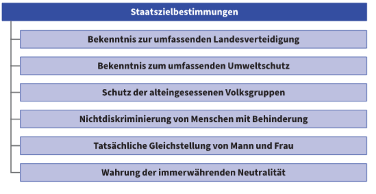
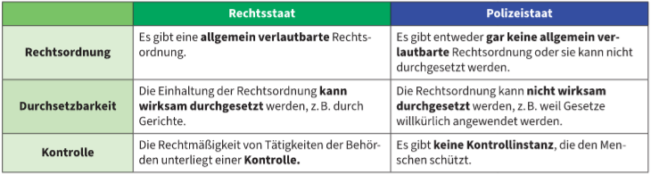
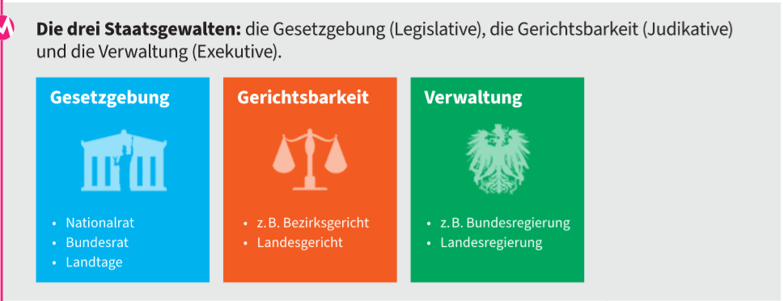

# Aufgaben und Grundlagen des Verfassungsrechts
---
### Verfassung - die Spielregeln des Staates
Staaten sind rechtlich geformte Wessen, welche gewisse Spielregeln, nach denen er funktionieren soll, braucht. Ebenso brauchen auch die machthabenden Personen Regeln, damit sie ihre Position nicht ausnutzen können.

**Verfassungen** sind die wichtigsten Grundregeln eines Staats, die angeben, wie der Staat funktionieren soll.

Dies sind in den meisten Verfassungen zu finden:
- **Staatsform** (Republik oder Monarchie)
- wie der Staat **aufgebaut** ist (als Bundesstaat oder Zentralstaat)
- die **Staatsfunktionen** (Gesetzgebung, Verwaltung und Gerichtsbarkeit)
- die **Grundrechte** der einzelen Menschen im Staat

### Die Staatszielbestimmungen

Staatszielbestimmungen: geben der Politik **positive Ziele**

**Immerwährende Neutralität**: als Staat neutral verhalten, fremde Truppen nicht auf eigenem Staatsgebiet stationieren zu lassen.

### Die Grundprinzipien der Verfassung

Innerhalb der Rechtsordnung herscht eine Hierarchie ,den **Stufenbau der Rechtsordnung**. Das bedeutet es existieren "höherrangige" und "niederrangige" Normen.

Die Verfassung gehört zum **obersten**,also zum **wichtisgten Rang**.

Die **Grundprinzipien** der Verfassung sind die **Fundamente** der Verfassung --> **höchster Rang** innerhalb der Verfassungsrecht.

Die Grundprinzipien werden hauptsächlich in sechs Prinzipien unterteilt:
- demokratische Prinzip
- gewaltenteilendes Prinzip
- liberales Prinzip
- rechtsstaatliches Prinzip
- bundesstaatliche Prinzip
- republikanisches Prinzip

 Jedoch sind sich Experten bei der Anzahl der Grundprinzipien nicht sehr oft einig. Bei den folgenden Grundprinzipien sind sie einig:
 
 - demokratisches Prinzip
 - republikanisches Prinzip
 - bundesstaatliches Prinzip
 - rechtsstaatliches Prinzip

##### Demokratisches Prinzip
 Demokratie = "Volksherrschaft"
 Prinzip: Das dem Recht unterworfene Volk soll selbst das Recht erzeugen.
 
 Das bedeutet, dass die Staatsbürger das Recht, durch teilnahme an staatliche Willensbildung und Machtausübungen, das Recht bestimmen. Durch Wahlen und Volksabstimmung.
 
 Gegenteil der Demokratie ist die Diktatur.
 
 In der Demokratie unterscheidet man zwischen der direkten und indirekten Demokratie. Die Art der Demokratie wird durch die Untersuchung der demokratischen Entscheidung getroffen.
 
 
 
 ##### Republikanische Prinzip
 Die Republik ist das Gegenstück zur Monarchie. In einer Republik werden die Regierenden für eine bestimmte Zeit vom Volk gewählt
 Unterschied zwischen Monarchie un Republik:
 **Stellung des Staatsoberhauptes.**
 
 
 ##### Bundesstaatliches Prinzip
 Bundesstaat, auch Zentralstaat genannt, ist das Gegenstück zu Einheitsstaat.
 
 In einem Bundesstaat argieren die Bundesländer(Provinzen) selbstständig. Das bedeutet jedes Bundesland seinen eigenen Landeshauptmann besitzt.
 
 ** Unterschiede zwischen Einheitsstaat und Bundesstaat**
 
 
 
 ##### Rechtsstaatliches Prinzip
 
 Ein Rechtsstaat hält sich an die Rechtsordnung.
 Das Gegenstück zum Rechstaat ist der Polizeistaat
 
  Das rechtsstaatliche Prinzip handelt von dem Legalitätsprinzip.
  
  Legalitätsprinzip ist ein zentraller Grundsatz in einem Rechtsstaat.
  
  In einem Rechtsstaat ist das Legalitätsprinzip ein **zentraler Grundsatz**. Durch dieses Prinzip wird die Verwaltung und die Gerichte mit dem Gesetz.
  Beide dürfen nur dann handeln, wenn sie ein Gesetz dazu ermächtigt und so weit handeln, wie das Gesetz es ihnen vorgibt.
  
  Das Legalitätsprinzip gibt auch an, dass der Gesetzgeber das Gesetz verständlich formulieren muss, damit das Gesetz vorhersehrbar ist.
  
  ##### Liberales Prinzip
  Ist für die **Freiheit der Menschen** im Staat zuständig. Dies ist vor allem in den **Grund- und Freiheitsrechten** deutlich.
  Beispiele:
  - das Recht auf Leben,
  - der Gleichheitsgrundsatz,
  - das Recht auf freie Meinungsäußerung,
  - das Recht auf Religionsfreiheit
  
  ##### Gewaltentrennendes Prinzip
  Trennt die Macht im Staat in mehreren Organen auf, damit die Macht im Staat nicht so leicht missbraucht wird.
  
  Folgenden Gewalten werden unterschieden:
  - die gesetzgebende Gewalt(= Legislative) beschließt die Gesetze
  - die Gerichtbarkeit(= Judikative) urteilt über Rechtsverletzungen
  - die Verwaltung vollzieht die Gesetze
   
  