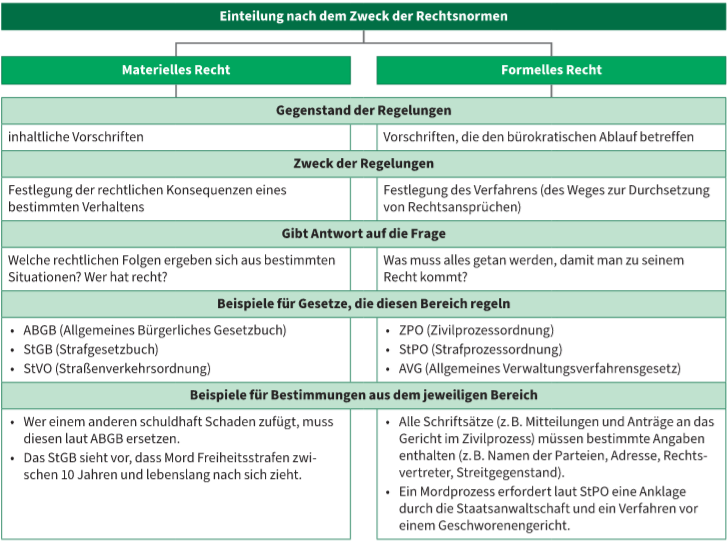
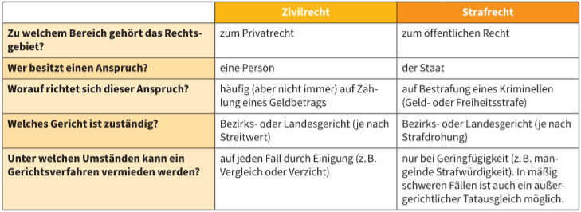

# Die Rechtsordnung
---
Das Recht ist für das Zusammenleben zuständig. Es besteht aus vertschiednen Rechtnormen. Recht ist mit staatlicher Gewalt durchsetzbar.

**Rechtsnormen** sind die Vorschriften für das Verhalten von Personen, welches den Zweck hat das Zusammenleben zu organisieren und Probleme zu lösen. ---> kann durch staatlichem Zwang durchgesetzt werden.

**Rechtsordnung**: Gemeinsamkeit der geltenden Rechtsnormen
**Rechtsquellen**: geschriebene oder ungeschriebene Grundlagen der Rechtsordnung(z.B. Verfassung, Gesetze, Gerichtsurteile,Verträge,usw.)

Subjekten, den man Rechtsordnung Rechte zuerkennt und meistens auch Pflichten auferlegt--> **Personen** oder **Rechtssubjekt**

Bei den Rechtssubjekten unterscheidet man zwischen **Natürliche Personen** und **Juristische Personen**.
- Natürliche Personen: Menschen, die von der Gerburt bis zum Tod Rechte und Pflichten haben.
- Juristische Personen: künstliche Konstruktionen, die von der Rechtsordnung wie Personen behandelt werden. (Bund -> Republik Österreich, Gemeinde, Vereine, AG, GsmbH)
Behörde: diejenigen die die Aufgabe der öfftentlichen Verwaltung wahrnehmen, berechtigt Zwangmaßnahmen zu setzen.

  
Das Legalitätsprinzip bestimmt die Behörde.

  
Personen, die von der Entscheidung eines Gerichts oder Verwaltungsbehörde betroffen sind -->Parteien

Wenn Partei mit der Entscheidung des Gerichts nicht einverstanden ist, kann sie ein Rechtmittel die Entscheidung anfechten.

### Art des Rechts

- Abgrenzung zwischen Zivil- und Strafrecht
   Zivilrecht: Kernbereich des Privatrechts
   
   Wenn eine Person ein Starftat begeht, ---> **zivilrechtliche und strafrechtliche Folgen**
   
   strafrechtliche Folge: Staat darf Kriminelle bestrafen.
   zivilrechtliche Folge: Opfer darf vom Täter eine Ersatz für den Schaden verlangen
   
   Damit zivilrechtliche Folgen entstehen, müssen keine straflich Folgen vorliegen:
   - **familienrechtliche Angelegenheiten**(Unterhaltsverpflichtungen,Obsorge der Kinder, Ehescheidung)
   - **in Erbrechtsanlagen**
   - **bei Streitigkeiten zwsichen Nachbarn**
   - **bei Säumigkeit von Schuldnern**
   
   
   
   ### Zugang zum Recht
   Um sich über die Rechtslagen zu informieren, werde folgende Quellen vorgeschlagen:
   
   - Juristische Literatur in Fachbibiliotheken
              
  - Rechtinformation im Internet
     www.ris.bka.gv.at  --> vom Bundeskanzleramt
   - Rechtsauskünfte von Gerichten
          - Bezirks- und Landesgerichte
          - Verwaltungsbehörde
          - Österreichischer Gewerkschaftsbund
          - Arbeiterkammern
          - Wirtschaftskammern
          - Mietervereinigung
          - Verein für Konsumenteninformation
          - ÖAMTC, ARBÖ
    ### Rechtsanwendung
	Die ist das Schema der gesetzlichen Bestimmung.
	
    Jedoch müssen nicht alle Ebenen in der gesetzlichen Bestimmung vertreten werden.
	
	Sachverhalt: konkreter Fall, welches in der Wirklichkeit passiert ist und rechtliche Folgen hat. Dafür werden die Beweise benötigt. Im Gesetz muss eine passender Tatbestand gefunden werden, welche den konkreten Fall einschließt. Interpretation. Wenn der Sachverhalt zum Tatbestand passt wird er subsumier (ihm untergeorndet)--> rechtliche Konsequenzen
	
	### Gewaltentrennung
	
	Damit Politiker ihr Macht nicht ausnutzen, sind in jeder Rechtsordnung Sicherheitsmechanismen eingebaut. Prinzip der Gewaltentrennung.
	
	Staatsgewalt teil sich in drei Funktionen auf
	
	
	### Stufenbau der Rechtsordnung
	- kann nur zustande kommen, wenn dies in einer der höherrangigen Norm vorgesehen ist
	- darf nicht gegen die ranghören Normen verstoßen
	
   
   
   Unterschied zwischen generellen und indiviuellen Rechtnormen
   - Generelle Rechtnormen müssen kundgemacht , verlautbart, veröffentlicht werden, damit sie gilt.
   - Bescheide, Urteile und Beschlüsse werden per Post an die Parteiein zugestellt. Übernahme durch Unterschift des Empfängers. First 14 Tage nach 14 Tagen tritt Rechtskraft ein.

### Die juristische Berufe
- Richter
      - Durchführung Zivil/Strafrechtlicher Prozesse
- Staatsänwälte 
       - Vertretung des Staats in Strafprozessen
- Bedienstete der Gerichte und Staatsanwaltschaften
      - Rechtspfleger, Gerichtvollzieher, Bezirkanwalt
- Juristen in der öffentlichen Verwaltung
      - Ministerien und nachgeordnete Dienststellen
- Notare 
      - öffentliches Amt und zur Objektivität verpflichtet
- Rechtsanwälte
      -Vertetung bei Prozessen 
- Juristen in der Privatwirtschaft
      -Rechtabteilung  
- Juristen in allen Berufssparten       
      - Immer brauchbar 
