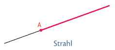
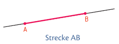
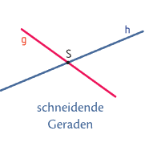
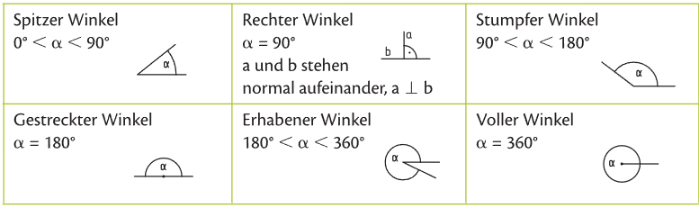
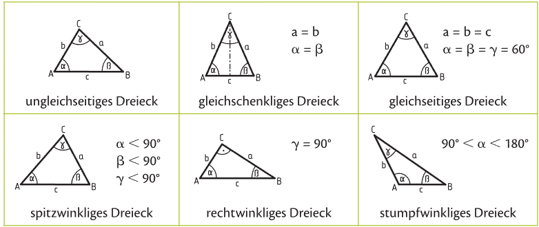
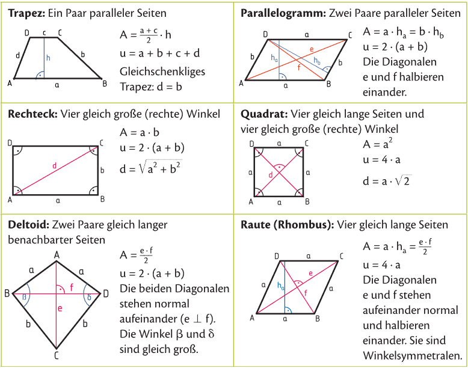

## Geometrie der Ebene
---
Die drei Grundelemten der Geometrie sind **Punkt**,**Gerade**,**Ebene**.

Grundelemente in Beziehung:

- **Strahl** (Halbgeraden): eine Gerade, welche einen Begrenzungspunkt besitz. 

- **Strecke**: eine Gerade, welche einen Anfang- und einen Endpunkt besitzt. 

- **parallel**: stehen die Punkte von zwei Geraden ident, so nennt man sie **parallel** g || h

- **Schnittpunkt**: sind zwei Gerade nicht parallel, so haben sie gemeinsam eine Schnittpunkt

#### Winkelpaare 
Wenn zwei Winkel sich auf 90° ergänzen heißen sie **komplementär**.
Wenn zwei Winkel sich auf 180° Ergänzen heißen sie **supplementär**.

#### Winkelarten

## Dreieck

## Vierecke und Vielecke

