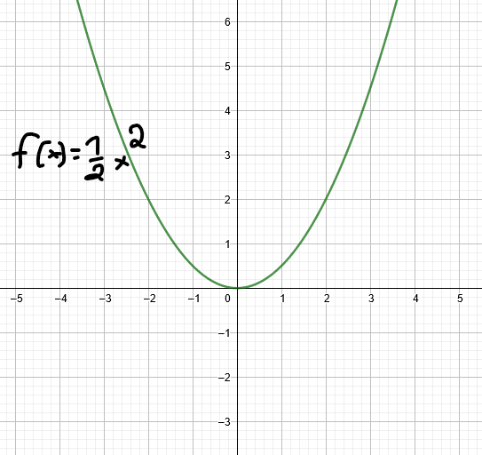
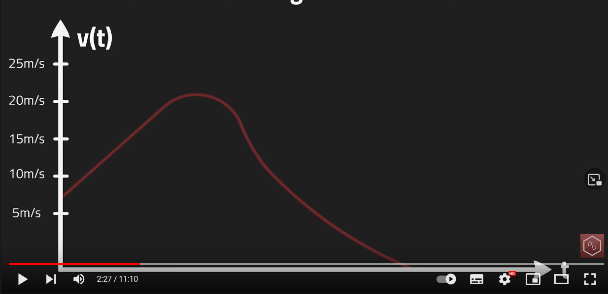
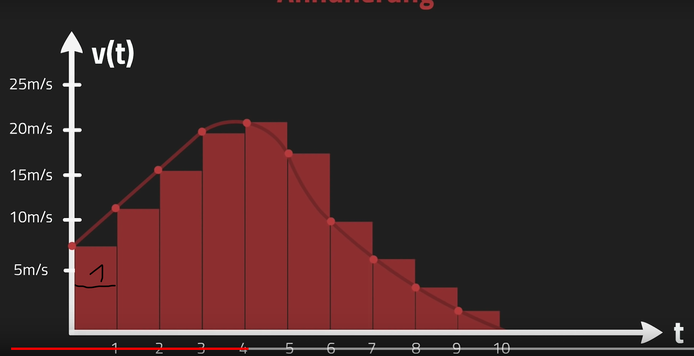
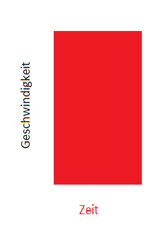
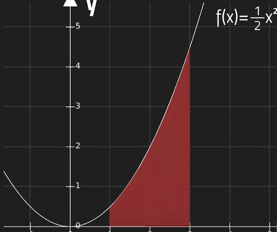

# Integral
---
Die Bildung der Stammfunktion ist das Integrieren.(Integral ist das Gegenteil der Ableitung)

f(x) = 3x - 2 ---> F(x) = $\frac{3}{2}$ x² - 2x + c
- Bildung der Stammfunktion:
     -  Exponent von x wird inkrementiert (+1)
     -  die erste Zahl wird durch den Exponentenzahl dividiert
     -  bei den restlichen Zahlen wird ebenso der Exponent inkremtiert
     -  zum Schluss wird c.. Konstante dazu addiert 

### Wozu braucht man den Integral?
Wenn man den Flächeninhalt unter der Kurve berechnen möchte, braucht man dafür den Integral.

Beispiel:
Jan fährt Lambo, sieht heiße Schnecke und bremst. Man möchte erfahren, wie weit man in 10 Sekunden gekommen ist. s = v*t

Die Fläche innerhalb der Funktion ergibt den genauen Weg, der in 10 Sekunden zurückgelegt wird. Jedoch ist die Berechnung nicht einfach, da die Funktion andauernd Veränderungen hat. Um die Berechnung  zu vereinfachen, zeichnet man Rechteck in die Funktion ein um eine Konstante in einem Zeitraum zu erstellen. In dem Fall wäre die Konstante 1s. Diese Art vereinfacht uns den Weg zu unserem Ergebnis. Das Zusammenrechnen der Flächeninhalte aller Rechtecke ergibt ein ähnliches Ergebnis.

Der **Flächeninhalt** = Zeit * Geschwindigkeit = **Streck in der Zeit s**

 Je kleiner die Rechtecke desto genauer das Ergebnis ---> Prinzip des Integrals
 Beispiel der Integralberechnung
 
 Von der Angegeben Funktion soll die Fläche vom Interval 1 bis 3 berechnet werden.
 $\int_1^3$ $\frac{1}{2}$x² dx 
 **WICHTIG!!** nie die Obere- und Untere-Grenze verwechseln
 $\frac{1}{2}$ x² =  $\frac{1}{6}$ x ³ + k
 F(3) + F(1) = $\frac{1}{6}$ 3 ³ + k - $\frac{1}{6}$ 1 ³ + k 