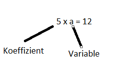
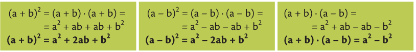

# Termen und Variablen
---
**Begriffe:**
Variablen = Platzhalter für Zahlen
Term = sinnvoller mathematischer Ausdruck,der aus Zahlen, Variablen und Rechenzeichen besteht (-12 x a)
Koeffizienten = Faktoren (eine Zahl in einer Multiplikation), die vor einer Variable stehen 

**Arten von Termen:**
Monom (eingliedriger Term): -1,15; x; a2b3; 5x2;
Binom (zweigliedriger Term) Summe oder Differenz zweier Monome: a + b; 2x2 + 4y3;
Polynom (mehrgliedriger Term) Summe oder Differenz mehrerer Monome: 2x2 + 4y3 + abc;
Polynom in einer Variablen (ganzrationaler Term):  4x2 - 6x + 9;
Bruchterm (gebrochen rationaler Term): $\frac{5}{x}$

## Rechenregel

- **Addition und Subtraktion**
   14x - 9xy - y - 6x + 5y = 8x - 9xy + 4y
   Bei der Additon und Subtraktion muss man auf die **Variablen** achten.
   Um mit den Termen rechnen zu können müssen die Terme dieselbe Variable haben. 
   Das heißt 14x - 4x = 10x, 14y- 4y = 10y, 14x - 4y = 14x - 4y
    - **Vorzeichenregel**
      Wenn vor einem Klammerterm ein **Minus** steht und man diesen Klammerterm auflösen möchte, ändert das Minus alle Vorzeichen einerhalb des Klammerterms.
      -(5a - b + 6) = -5a + b - 6 
- **Multiplikation**
Das Kommutativgesetz wird eingesetzt.
3x * 6y = 18xy
- **Distributivgesetz**
(a + b) * (c + d) = ac + ad + bc + bd
- **Herausheben(Faktorisieren)**
30ab - 15ac = 15a * (2b - c)
## Potenzen
an = a * a * a * ..a,
a0 = 1
a-n = a -n = $\frac{1}{a^n}$

- Rechnen mit Potenzen
Um Potenzen zu addieren oder zu subtrahieren müssen sie gleiche Basis haben.
an * am = a n + m
$\frac{a^n}{a^m}$ = a n-m
(an)m = an*m
(a * b)n = a n * b n 
($\frac{a}{b}$)n = $\frac{a^n}{b^n}$
- Binomische Formeln

## Bruchterme
- Doppelbruchterm: $\frac{\frac{a}{b}}{\frac{c}{d}}$ = $\frac{a}{b}$ * $\frac{c}{d}$