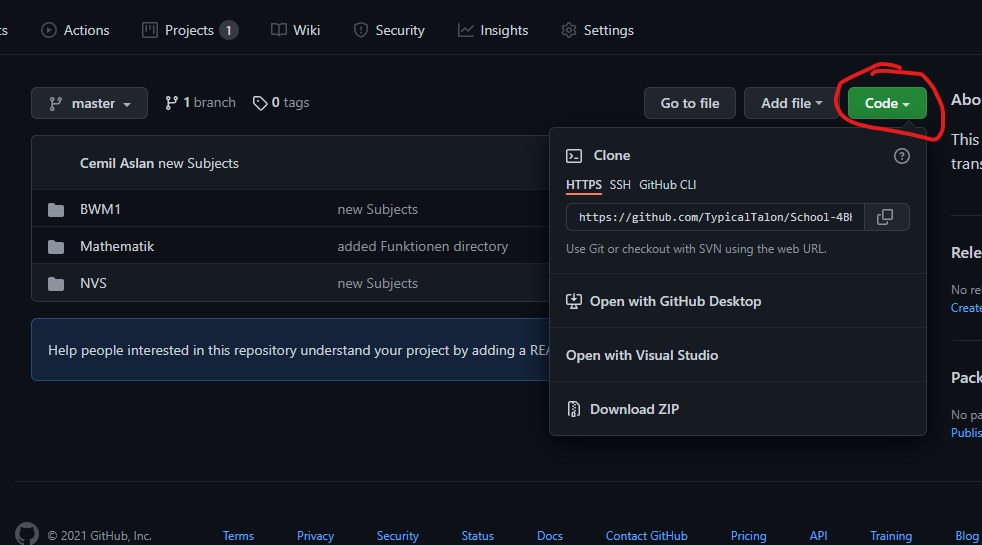
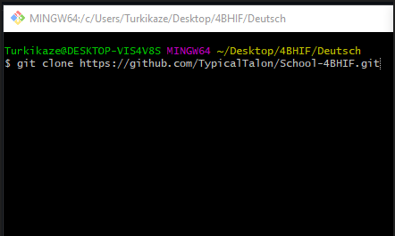
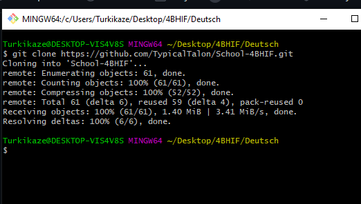
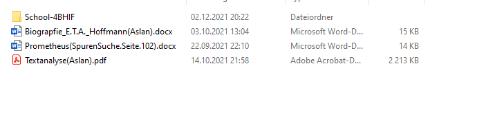

## Introduction
This Repository is  for school purpose.

### You want to join us?
1. First of all we use a programm called Obsidian. Obsidian is a good program to use markdown files as lecture notes. 
https://obsidian.md/
So visit the page and  download Obsidian.
2. You have to clone the repository. In order to clone it click in the repository the "Code" button and copy the showen link.

3. Choose a optional directory and right click in an empty space. If you already have Git on your PC, Git options will appear. Press on the "Git Bash here" button.
![[GitBashHere.png]]

4. After pressing the button, a console application will appear. Write " git clone " + paste the copied link  and press enter.

5.  Now you should have the repository in your directory.

If you have any problem please contact me !